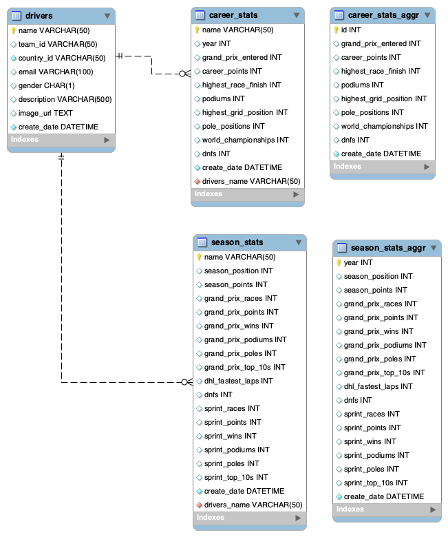

# SKN21-1st-5Team
## 🏎️ [팀 단위 프로젝트] F1 Racer 데이터 대시보드

### ✨ 프로젝트 개요

| 항목 &nbsp;&nbsp;&nbsp;&nbsp;&nbsp;&nbsp;&nbsp;&nbsp;&nbsp;&nbsp;&nbsp;&nbsp;&nbsp;&nbsp;&nbsp;&nbsp;&nbsp;&nbsp; | 내용 |
| :--- | :--- |
| **팀명** | **판타스틱 파이브 (Fantastic Five)** |
| **주제** | **F1 Racer 데이터 대시보드** |
| **목표** | F1 공식 데이터를 크롤링하고 구조화하여, 사용자 친화적인 웹 대시보드를 통해 실시간에 가까운 순위, 일정, 상세 레이스 결과를 제공합니다. |
| **기술 스택** | Python, `Streamlit`, `requests`, `BeautifulSoup`, SQL (DB) |

-----

## 1\. 팀원 및 담당 업무

| 이름 &nbsp;&nbsp;&nbsp;&nbsp;&nbsp;&nbsp;&nbsp;&nbsp;&nbsp;| 역할 | 핵심 담당 기술 | 담당 상세 업무 |
| :--- | :--- | :--- | :--- |
| **가람** | **PM (Project Manager)** | SQL, WebCrawling, Streamlit | 프로젝트 총괄 및 관리, 핵심 크롤링 로직 개발 지원, 데이터베이스 레이서 정보 연동. |
| **병탁** | 팀원 | SQL, Streamlit | 데이터베이스 구조 설계, 데이터베이스 레이서 정보 연동, Streamlit 화면 레이아웃 작업. |
| **성진** | 팀원 | WebCrawling, Streamlit | 레이스 결과 및 상세 데이터 크롤링, 크롤링 데이터 시각화 담당. |
| **현우** | 팀원 | WebCrawling, Streamlit | 이벤트 스케줄 및 타이밍 데이터 크롤링, 위젯 기반 인터랙티브 기능 구현. |
| **세연** | 팀원 | Data Analysis, Revising | 수집 데이터 분석 및 통계 제공, 최종 보고서 및 문서 검토/수정, 회고 총괄. |

-----

## 2\. 프로젝트 주제 및 선정 이유

### 2.1. 주제

**F1 Racer 데이터 대시보드**

### 2.2. 주제를 선택한 이유

세계 최고 수준의 모터스포츠인 **F1 (Formula 1)** 은 방대한 양의 정교한 레이싱 데이터를 생성합니다. 

해당 데이터를 크롤링하고 분석하여, 팬들과 데이터 분석가 모두에게 유용한 **실시간 순위, 일정, 레이스 상세 분석 자료**를 통합적으로 제공하는 플랫폼을 구축하고자 주제를 선정했습니다. 

이는 데이터 수집부터 시각화까지의 **Full Data Pipeline** 구축 경험에 최적화된 주제입니다.

### 2.3. 주요 기능

  * **데이터 수집:** **웹 크롤링 (`BeautifulSoup`, `requests`)** 을 통해 F1 공식 웹사이트의 레이서 데이터를 효율적으로 수집.  
  [F1 Drivers 2025](https://www.formula1.com/en/drivers)
  * **데이터 저장:** 수집한 데이터를 **SQL 데이터베이스**에 구조화하여 저장 및 관리.
  * **대시보드 구현:** **`Streamlit`** 을 활용하여 사용자 친화적인 레이아웃과 인터랙티브한 시각화 화면 구성.

-----

## 3\. 프로젝트 디렉토리 및 파일 구조

프로젝트의 모듈화 및 효율적인 협업을 위해 다음과 같은 구조를 사용합니다.
```
SKN21-1st-5Team
├─ app.py
├─ data
│  ├─ connect.py
│  ├─ constant.py
│  ├─ driver.py
│  ├─ f1_movie_brad_pitt.png
│  ├─ flag
│  │  ├─ argentina.png
│  │  ├─ ...
│  │  └─ thailand.png
│  └─ logo.png
├─ pages
│  ├─ driver_comparison.py
│  ├─ driver_dashboard.py
│  ├─ driver_detail.py
│  ├─ driver_intro.py
│  └─ driver_search.py
└─ sql
   ├─ DDL.sql
   ├─ db_connect.py
   ├─ drivers.py
   └─ statistics.py

```

-----

## 4\. 수집 데이터 설명

| 데이터 유형 | 상세 항목 | 크롤링 목적 및 활용 |
| :--- | :--- | :--- |
| **Event Schedule** &nbsp;&nbsp;&nbsp;&nbsp;&nbsp;&nbsp;&nbsp;&nbsp;&nbsp; | Drivers, Session status, Career status. | **활용:** 2025년 시즌 레이서 페이지 구성, 향후 비교 분석 시각화. |
| **Results** | Driver names, Team names, Finishing and Grid positions, Points earned, Finishing status. Session Results. | **활용:** 챔피언십 순위 테이블 및 레이서 결과 제공. |
| **Timing Data** | Sector times, Lap times, Pit stop duration, Tyre data (compound, age) | **활용:** 상세 분석 페이지에서 레이서/팀별 성능 비교 및 전략 분석 자료로 활용. |

-----

## 5\. 데이터베이스 테이블 설명

수집 데이터를 효율적으로 저장하고 Streamlit에서 빠르게 조회하기 위해 5개의 테이블을 설계합니다.



| 테이블명 &nbsp;&nbsp;&nbsp;&nbsp;&nbsp;&nbsp;&nbsp;&nbsp;&nbsp;&nbsp;&nbsp;&nbsp;&nbsp;&nbsp;&nbsp;&nbsp;&nbsp;&nbsp;&nbsp;&nbsp;&nbsp;&nbsp;&nbsp;&nbsp;&nbsp;&nbsp;&nbsp;| 역할 &nbsp;&nbsp;&nbsp;&nbsp;&nbsp;&nbsp;&nbsp;&nbsp;&nbsp;&nbsp;&nbsp;&nbsp;&nbsp;&nbsp;&nbsp;&nbsp;&nbsp;&nbsp;&nbsp;&nbsp;&nbsp;&nbsp;&nbsp;&nbsp;&nbsp;&nbsp;&nbsp;&nbsp;&nbsp;&nbsp;&nbsp;&nbsp;&nbsp;&nbsp;&nbsp;&nbsp;&nbsp;&nbsp;&nbsp;&nbsp;&nbsp;&nbsp;&nbsp;&nbsp;&nbsp;&nbsp;&nbsp;&nbsp;&nbsp;&nbsp;&nbsp;&nbsp;&nbsp;&nbsp;| 주요 필드 및 설명 | 연관 관계 |
| :--- | :--- | :--- | :--- |
| **`Drivers`** | 레이서의 기본 정보 | `Name` (PK), `Team id`, `Country id`, `Image url` | |
| **`Career stats`** | 레이서 성적 정보 | `Name` (FK), `Grand prix entered`, `Career points`, `DNFs` |  Drivers (1:N) |
| **`Career stats aggr`** | 모든 레이서들의 성적 정보 평균값 | `Name` (FK), `Grand prix entered`, `Career points`, `DNFs` | |
| **`Season stats`** | 각 레이스의 시즌 성적 정보 | `Name` (FK), `Season position`, `Season points`, `DNFs`  | Drivers (1:N) |
| **`Season stats aggr`** | 모든 레이스의 시즌 성적 정보 평균값 | `Name` (FK), `Season position`, `Season points`, `DNFs`  | |

-----

## 6\. Application의 주요 기능

### Application 제공하는 기능 설명

| 기능 카테고리 &nbsp;&nbsp;&nbsp;&nbsp;&nbsp;&nbsp;&nbsp;&nbsp;&nbsp;&nbsp;&nbsp;&nbsp;&nbsp;&nbsp;&nbsp;&nbsp;&nbsp;| 상세 기능 및 Streamlit 활용 |
| :--- | :--- |
| **레이서 정보** | `st.tabs`를 이용해 레이서 순위와 컨스트럭터 순위를 분리하여 제공. 시즌별 \*\*`st.selectbox`\*\*로 데이터 필터링. |
| **시즌 스케줄** | 예정된 이벤트와 종료된 이벤트를 명확히 구분하여 표시. `st.map`을 활용해 다음 레이스 서킷의 지리적 위치 시각화. |
| **상세 결과 조회** | \*\*`st.selectbox`\*\*로 특정 그랑프리를 선택하면, 해당 레이스의 그리드 포지션, 최종 순위, 랩 타임 최고 기록 등의 상세 데이터를 표로 제공. |
| **데이터 분석** | 레이서별 **누적 포인트 추이**를 \*\*`st.line_chart`\*\*로 시각화하여 챔피언십 경쟁 구도를 한눈에 파악. Pit Stop 전략 등 타이밍 데이터 기반의 분석 차트 제공. |
| **UI/UX 편의성** | `st.sidebar`를 통해 주요 설정(시즌 선택, 메뉴 전환)을 간편하게 조작할 수 있도록 구현. |

-----

## 7\. 회고 (Retrospective)

### 7.1. 구현 도중 생겼던 문제와 해결 과정

| 이름 | 발생 문제 | 해결 과정 |
| :--- | :--- | :--- |
| **가람 [PM]** | 정적 웹 사이트에서 웹 크롤링을 진행해서 크게 어려움은 없었으나, 첫화면에서 DB 크롤링 데이터를 받아오는 로직과 화면마다 반복적으로 불필요한 크롤링이 발생. | 첫 화면에서 기존 데이터가 없을 때, 레이서 리스트를 받아오고 시간차를 두고 레이서 각각의 상세 데이터를 크롤링하는 방법을 이용. 또한, 캡슐화를 통해 반복적인 크롤링을 하지 않고 필요할 때만 실행되도록 변경해주었음. |
| **병탁** | Streamlit의 **데이터프레임 캐싱** 문제로 인해 DB 업데이트 후에도 화면에 구 버전 데이터가 계속 표시됨. | `st.cache_data`나 `st.cache_resource`의 `ttl` 매개변수를 조정하거나, DB 데이터 로딩 함수에 `@st.experimental_memo(suppress_callback_exceptions=True)` 데코레이터를 적용하여 해결. |
| **성진** | **상세 레이스 결과 페이지 URL**이 그랑프리 이름이 아닌 고유 ID 값으로 되어 있어 동적으로 URL을 구성하기 어려움. | 스케줄 페이지에서 각 그랑프리 링크의 `href` 속성을 먼저 크롤링하여 ID 값을 추출하고, 이 ID를 기반으로 상세 결과 페이지의 URL을 조합하는 2단계 크롤링 로직 구축. |
| **현우** | 크롤링된 랩 타임, 섹터 타임 등의 **시간 데이터** 형식이 통일되지 않아 DB 저장이 어려움. | Python의 `datetime` 모듈과 정규 표현식(`re`)을 사용하여 모든 시간 데이터를 초(seconds) 단위의 **Float** 형태로 통일한 후, DB에 숫자형으로 저장하여 분석 용이성을 확보. |
| **세연** | **컨스트럭터(팀) 순위**와 **레이서 순위** 테이블의 필드가 달라 데이터베이스 `Results` 테이블에 통합 저장 시 비효율 발생. | `IsConstructor`라는 **Boolean** 필드를 추가하여 한 테이블에서 레이서 결과와 컨스트럭터 결과를 모두 저장하되, 쿼리 시 해당 플래그로 필터링하여 문제 해결. |

### 7.2. 각자 프로젝트 진행하면서 느낀 점

| 이름 | 느낀 점 |
| :--- | :--- |
| **가람 [PM]** | PM으로서 팀원들의 기술적 문제를 조율하고 전체 파이프라인을 연결하는 과정이 가장 중요했습니다. 짧은 시간이었지만 팀원 모두가 작은 기능이라도 직접 개발하며 함께 공부해볼 수 있는 프로젝트가 될 수 있게 노력했습니다. |
| **병탁** | 파이썬과 SQL을 연동하고, 그 결과를 Streamlit의 인터랙티브 위젯과 연결하는 과정이 흥미로웠습니다. 특히 사용자가 버튼을 누를 때마다 데이터가 새로고침되도록 로직을 구성하는 과정에서 웹 앱 개발의 기초적인 개념을 익힐 수 있었습니다. |
| **성진** | 다양한 레이스 결과 페이지를 크롤링하면서 웹사이트 구조가 예상과 다를 수 있다는 점을 깨달았습니다. 데이터를 추출하기 위해 HTML 요소를 분석하는 과정이 까다로웠지만, 결국 원하는 데이터를 깔끔하게 추출했을 때 큰 성취감을 느꼈습니다. |
| **현우** | 비록 제가 코딩에 있어서 너무 초급수준 단계에 있었지만, Streamlit과 Web Crawling의 활용을 잘복습해서 어렵지만 조금이라도 프로잭트에 보탤수 있어서, 저에게 있어선 의미가 있는 프로잭트의 시작이자, 이 프로잭트 기간을 통해서 다시한번 더 배울수 있는 기간이였던것 같습니다.  |
| **세연** | 데이터 분석가로서 크롤링과 DB 설계 단계부터 참여하여, 최종 분석 단계에서 필요한 데이터 형태가 무엇인지 미리 제시할 수 있었습니다. 회고록을 정리하면서 팀의 문제 해결 과정을 되돌아보는 것이 프로젝트의 완성도를 높이는 데 결정적인 역할을 한다는 것을 깨달았습니다. |


